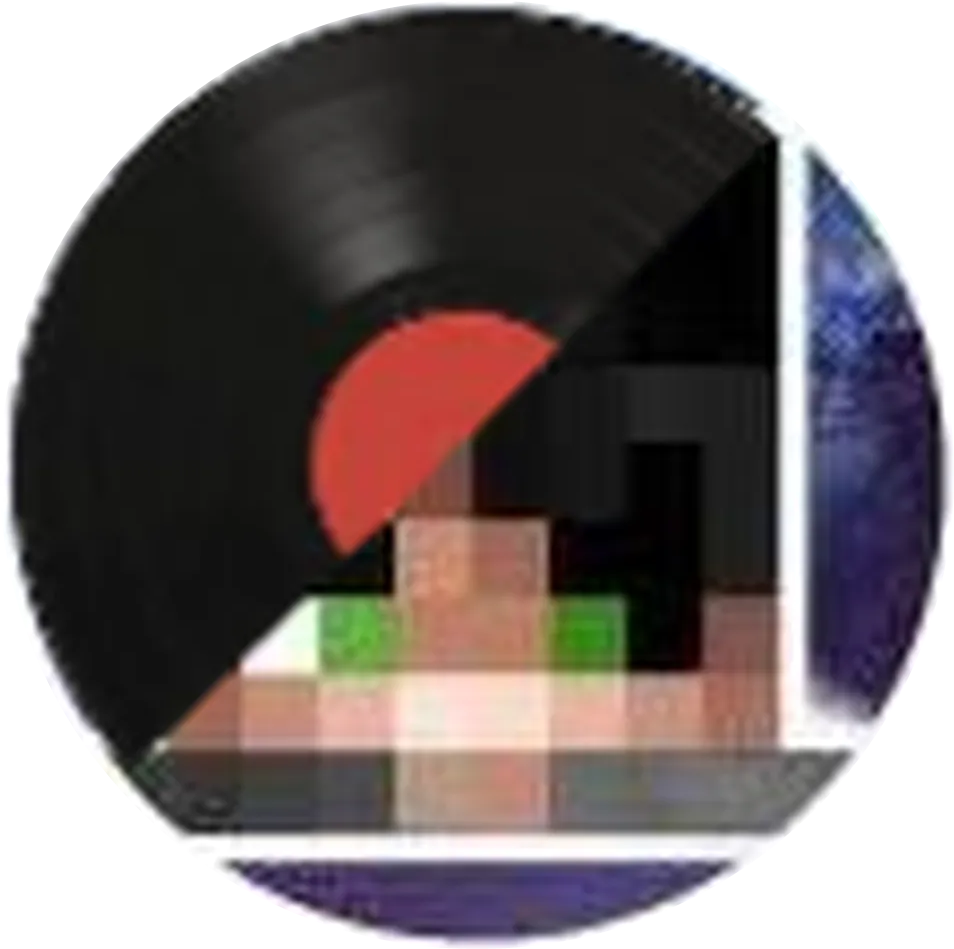

<p align="center">
  
</p>
<p align="center">
  <strong>PianoNic's Music Bot</strong><br/>
  Paste a link. It plays. Nothing to register.
</p>
<p align="center">
  <a href="https://github.com/PianoNic/PianoNicsMusic"></a>
  <a href="https://github.com/PianoNic/PianoNicsMusic/releases"></a>
  <a href="https://github.com/ArgonFetch/ArgonFetch"></a>
  
</p>

---

## What is PianoNic's Music Bot?

A Discord music bot that plays whatever you paste at it - a YouTube link, a Spotify album, a SoundCloud set, a TikTok, a file you dragged into the channel, or just the name of a song.

It does not resolve any of that itself. Every link goes to [ArgonFetch](https://github.com/ArgonFetch/ArgonFetch), which runs beside the bot in its own container and answers with the title, the artwork and a stream to play. That is one moving part instead of a retriever per platform, and it is the part that keeps its own yt-dlp current - every twelve hours, without rebuilding the bot. When a source changes something, ArgonFetch catches up on its own.

No API keys. Spotify included.

## Features

- **Anything with a link**: YouTube, Spotify, SoundCloud, TikTok, Instagram, direct audio files, Discord attachments, and everything else yt-dlp reaches.
- **Search without a link**: type a song name and the first sensible result plays.
- **Real playlists**: a YouTube playlist, Spotify album or SoundCloud set resolves in one call, and the queue shows every track's title and artist before any of them play.
- **Spotify without credentials**: metadata comes off the public pages and the audio from the matching YouTube Music result, so a Spotify link shows Spotify's title and cover art.
- **Queue control**: skip, loop, shuffle, force-play a track next, and see what is coming.
- **Sound shaping**: per-server volume and bass, adjusted live on the playing track. Earrape, if that is your thing.
- **Slash and prefix**: every command works as `/play` or as `.play`, `!play`, `$play`.
- **Stays up**: a source that is region-locked, private or DRM-protected is reported and skipped rather than killing the queue.

## Get started

**1. Create `compose.yml`:**

```yaml
services:
  pianonic-music-bot:
    image: pianonic/pianonicsmusic:latest
    container_name: pianonic-music-bot
    environment:
      - DISCORD_TOKEN=${DISCORD_TOKEN}
      - ARGONFETCH_URL=http://argonfetch:8080
    depends_on:
      - argonfetch
    restart: unless-stopped

  argonfetch:
    image: ghcr.io/argonfetch/argonfetch:latest
    container_name: pianonic-music-argonfetch
    environment:
      - Plugins__Repositories__0=https://raw.githubusercontent.com/ArgonFetch/ArgonFetchPlugins/repo/index.json
      - Plugins__Install__0=spotify
      - Plugins__Install__1=tiktok
    volumes:
      # yt-dlp and FFmpeg are fetched on boot rather than baked in. Keeping them
      # here means a restart reuses them instead of downloading 100MB again.
      - argonfetch-tools:/tools
    restart: unless-stopped

volumes:
  argonfetch-tools:
```

**2. Create `.env` next to it:**

```env
DISCORD_TOKEN=your-token-here
```

**3. Start it:**

```bash
docker compose up -d
```

ArgonFetch spends its first few seconds fetching yt-dlp and FFmpeg, and answers `503` until it is done. The bot waits and retries, so an early `/play` resolves a moment later rather than failing.

<details>
<summary><strong>Creating the Discord bot</strong></summary>

1. Open the [Discord Developer Portal](https://discord.com/developers/applications) and click **New Application**.
2. Under **Bot**, click **Reset Token** and copy it. That is your `DISCORD_TOKEN`.
3. Under **OAuth2 → URL Generator**, tick the `bot` and `applications.commands` scopes.
4. Under Bot Permissions, tick **Connect** and **Speak**.
5. Open the generated URL and invite the bot to your server.

</details>

<details>
<summary><strong>Running without Docker</strong></summary>

```bash
git clone https://github.com/PianoNic/PianoNicsMusic.git
cd PianoNicsMusic
python -m venv venv && source venv/bin/activate
pip install -r requirements.txt
python main.py
```

Needs FFmpeg on `PATH`, a `DISCORD_TOKEN`, and an ArgonFetch instance. Point `ARGONFETCH_URL` at your own; without it the bot looks for `http://argonfetch:8080`.

</details>

## Commands

Every command works as a slash command and behind the `.`, `!` and `$` prefixes.

| Command | Aliases | What it does |
| :--- | :--- | :--- |
| `play` | `p`, `pl`, `add`, `enqueue` | Play a link, a search, or an attached file |
| `force_play` | `fp`, `forceplay` | Put a track next in line |
| `pause` / `resume` | `hold` / `continue` | Pause and resume |
| `skip` | `next`, `play_next` | Skip the current track |
| `stop` / `leave` | `disconnect`, `bye` | Stop, clear the queue and disconnect |
| `loop` | `lp`, `repeat` | Loop the queue |
| `shuffle` | | Randomise the queue order |
| `queue` | `q`, `list` | Show what is playing and what is next |
| `bot_status` | `status`, `now_playing` | Connection, queue and filter state |
| `volume` | `v`, `vol` | Set or show volume (0-100) |
| `volume_up` / `volume_down` | `vol+` / `vol-` | Step volume by 10% |
| `bass_boost` | `bass`, `b` | Set or show bass (0-200, 100 is flat) |
| `earrape` | `ear`, `er` | Toggle the distortion filter |
| `help` | `h`, `cmds` | List every command |
| `ping` | | Round-trip latency |
| `information` | `ver`, `version` | Version and runtime info |

## Configuration

| Variable | Required | Description |
| :--- | :--- | :--- |
| `DISCORD_TOKEN` | yes | Your bot token |
| `ARGONFETCH_URL` | no | ArgonFetch instance. Defaults to `http://argonfetch:8080` |
| `MAX_QUEUE_TRACKS` | no | Cap on one playlist. Defaults to `500` - some editorial playlists run to five figures |

## Troubleshooting

- **Nothing plays, everything errors.** Check the ArgonFetch container is up: `docker compose logs argonfetch`. The bot has no fallback resolver by design.
- **"The media service is updating itself."** ArgonFetch is installing a yt-dlp update. It takes seconds; the bot retries on its own.
- **A single song fails.** Region locks, private videos and DRM-protected SoundCloud tracks are reported and skipped. Nothing to fix.
- **Bot joins but is silent.** FFmpeg is missing from the bot image, or it lacks Connect and Speak in that channel.

## License

[CC BY-NC 4.0](LICENSE.md). Copyright PianoNic.

Read it, change it, and run it for any noncommercial purpose. Commercial use is not licensed.

---

<p align="center">Made with care by <a href="https://github.com/PianoNic">PianoNic</a></p>
